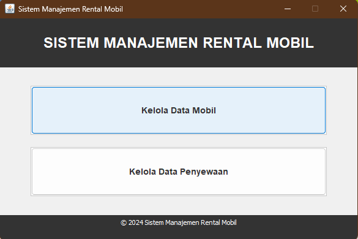
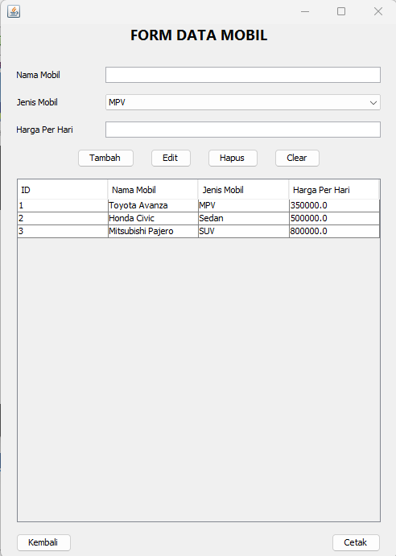
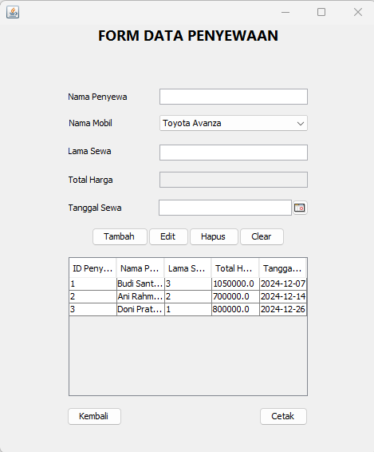
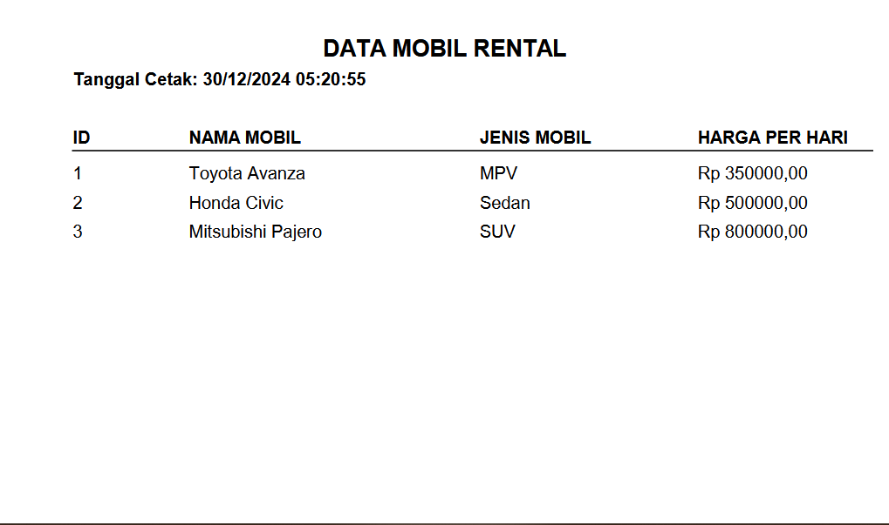
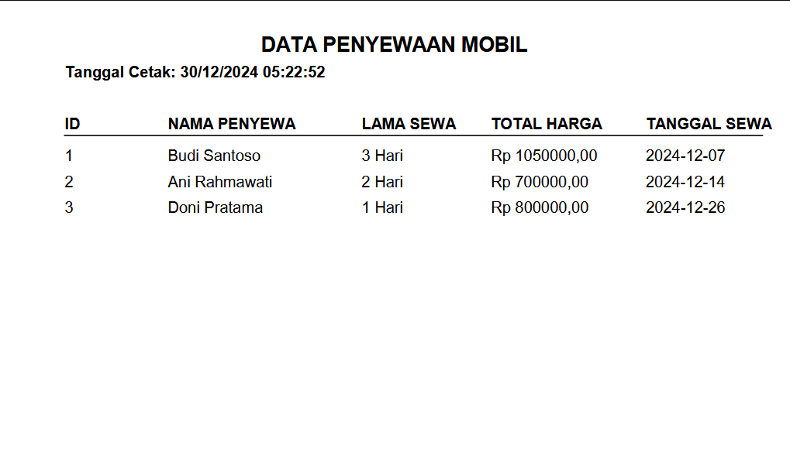

# Aplikasi Rental Mobil

NIM: 2210010247
Nama: Noor Admayanti

## Deskripsi Proyek
Aplikasi Rental Mobil ini dikembangkan sebagai tugas akhir untuk mata kuliah PBO. Aplikasi ini memungkinkan pengguna mengelola data rental mobil sederhana seperti input data mobil dan data penyewaan.

## Tampilan Aplikasi

## Struktur Direktori
- src/: Berisi kode sumber aplikasi.
- lib/: Berisi pustaka atau library yang digunakan dalam pengembangan.
- database/: Berisi file terkait basis data.
- screenshot/: Berisi tangkapan layar aplikasi.
- build.xml: File konfigurasi untuk proses build.
- manifest.mf: File manifest untuk aplikasi.

## Cara Menjalankan Aplikasi
1. Kloning repositori ini:
   git clone https://github.com/NoorAdmayanti/UAS-AplikasiRentalMobil.git

2. Buka proyek dengan NetBeans:
   - Pilih File > Open Project dan arahkan ke folder hasil kloning.

3. Bangun dan jalankan aplikasi:
   - Klik kanan pada proyek dan pilih Build.
   - Setelah proses build selesai, klik kanan lagi dan pilih Run.

## Prasyarat
- NetBeans IDE: Disarankan menggunakan versi terbaru.
- JDK: Minimal versi 8 atau yang lebih baru.
- Database: Pastikan server database (misalnya MySQL) berjalan dan konfigurasi sesuai dengan pengaturan di aplikasi.

## Kontribusi
Kontribusi untuk pengembangan lebih lanjut dipersilakan. Silakan fork repositori ini dan buat pull request dengan perubahan yang diusulkan.

## Lisensi
Proyek ini dilisensikan di bawah [nama lisensi]. Silakan lihat file LICENSE untuk informasi lebih lanjut.
